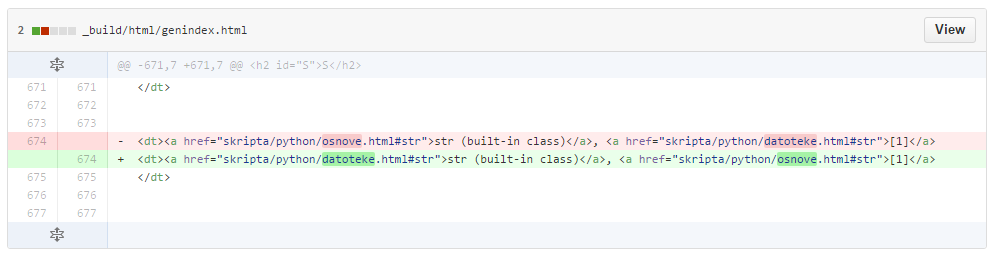

Uvod
====

Git je sistem za spremljanje zgodovine verzij datotek (ang. version control system ali VCS, tudi revision control system ali RVS), ki hrani vse pretekle verzije datotek, ki smo jih v neki točki izrecno “shranili” s pomočjo posebnega ukaza “commit”. Vsa zgodovina je shranjena v (skriti) mapi imenovani “.git”. Na disku je vedno vidna samo ena verzija datoteke - tista na kateri trenutno delamo. Do različnih verzij pridemo lahko s posebnimi ukazi, ki restavrirajo želeno verzijo v aktivno mapo.

Ni nujno, da so vse datoteke v mapi pod kontrolo Git - moramo jih eksplicitno dodati. Dodane datoteke potem Git spremlja. Preden jih “commitamo”, jih moramo najprej dodati v “staging area”, kjer čakajo na naš “commit”. Konkreten potek bo viden tekom dela.

Git ima še mnogo možnosti, ki večinoma pridejo v poštev pri skupinskem delu, kjer naj bi Git najbolj blestel.